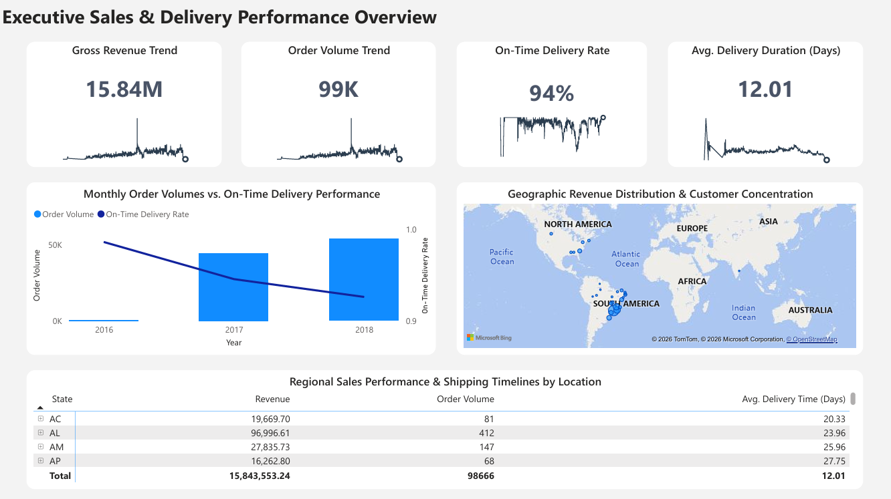
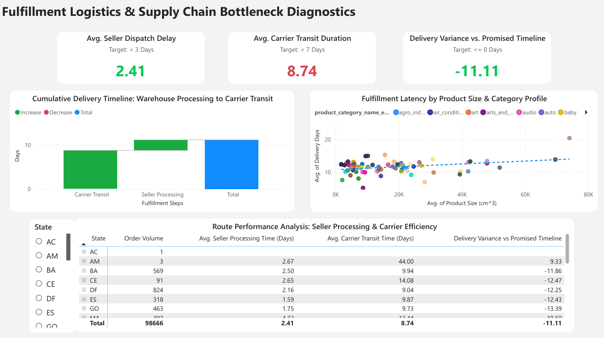
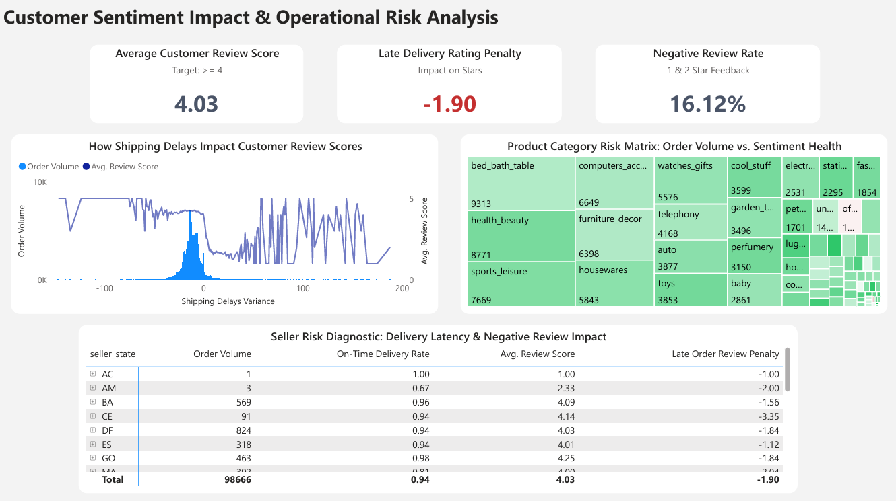

# End-to-End E-Commerce Supply Chain & Customer Sentiment Dashboard

## Key Business Insights Uncovered
- <b>The Critical Late Order Penalty:</b> The data mathematically proves that late deliveries inflict an immediate, harsh <b>1.90-star penalty</b> on customer satisfaction scores, pulling otherwise healthy customer sentiment down drastically.
- <b>Carrier Transit Bottlenecks:</b> While independent sellers are often blamed for fulfillment lag, the data isolates transit efficiency as the primary constraint. The national average for Seller Dispatch Delay stands at a lean <b>2.41 days</b> (beating the < 3-day target), whereas Average Carrier Transit Duration balloons to <b>8.74 days</b> (failing the < 7-day target).
- <b>Volumetric Capacity Risk:</b> The Page 2 multi-variable scatter plot reveals a distinct positive correlation between physical package volume (cm<sup>3</sup>) and delivery duration across specific product categories, indicating capacity constraints inside standard shipping networks.

## Setup Instructions:
1. Clone the repository.
2. Download dataset from <a href="https://www.kaggle.com/datasets/olistbr/brazilian-ecommerce">Kaggle</a>
3. Copy .env.example to a new file named .env and fill in your local PostgreSQL credentials.

## Project Overview:
This enterprise-grade, 3-page Power BI dashboard analyzes logistics performance, identifies supply chain bottlenecks, and correlates delivery latencies directly with customer sentiment (review scores). Developed using a structured data model and advanced analytical DAX modeling, this tool serves as a strategic and operational decision-making framework for e-commerce executive leadership.







## The Business Problem:
Logistics and fulfillment friction directly threaten brand retention and bottom-line revenue. However, businesses frequently treat supply chain metrics and customer experience feedback as isolated data silos.
*   **The Goal:** Build an integrated analytics suite that quantifies *how* physical bottlenecks (processing delays, carrier transit times, product weight/volume dimensions) impact customer star ratings, and isolate high-risk regional routes and sellers.

## 3-Page Analytical Architecture:
The dashboard is structured using a Top-Down (Macro-to-Micro) Analytical Framework:

### Page 1: Executive Sales & Delivery Performance Overview
*   **Target Audience:** C-Suite Executives & Regional Directors.
*   **Core Focus:** High-level macroeconomic health of the business. Includes revenue performance ($15.84M total), monthly order volumes (99K total), and aggregate On-Time Delivery Rates (94%).
*   **Key Design Highlight:** Custom dynamic inline SVG sparklines built into the KPI cards to show historic metric trends directly inside the primary numeric containers.

### Page 2: Fulfillment Logistics & Supply Chain Bottleneck Diagnostics
*   **Target Audience:** Logistics Managers & Supply Chain Coordinators.
*   **Core Focus:** Isolating the physical phases of fulfillment latency.
*   **Key Design Highlight:** A custom chronological milestone waterfall chart separating transit time from processing time, alongside a multi-variable scatter plot correlating physical package volume (cm<sup>3</sup>) with delivery duration to pinpoint capacity strain.

### Page 3: Customer Sentiment Impact & Operational Risk Analysis
*   **Target Audience:** Vendor Management & Customer Experience (CX) Teams.
*   **Core Focus:** Quantifying the direct impact of late deliveries on brand reputation.
*   **Key Design Highlight:** An advanced integrated Area and Line chart combination tracking delivery variance days against review scores, accompanied by a dynamic seller-level risk matrix to pinpoint exactly which vendors are driving down customer satisfaction.

## Technical Highlights & DAX Engineering
### 1. Dynamic Inline SVG Sparklines (Page 1 Cards)
To bypass the limitations of basic native card visuals, custom line vectors were drawn dynamically using DAX text-concatenation inside a virtualized date table. The image_tag output is categorized as an Image URL to render a high-performance vector trendline directly within the card background.

```
sparkline_total_revenue = 
// Static line color 
VAR LineColour = "#2C3E50"
VAR PointColour = "white"
VAR Defs = "<defs>
    <linearGradient id='grad' x1='0' y1='25' x2='0' y2='50' gradientUnits='userSpaceOnUse'>
        <stop stop-color='%23666666' offset='0' />
        <stop stop-color='%23CCCCCC' offset='0.3' />
        <stop stop-color='white' offset='1' />
    </linearGradient>
</defs>"

// "Date" field used in this example along the X axis
VAR XMinDate = MIN('analytics vw_executive_overview'[date])
VAR XMaxDate = MAX('analytics vw_executive_overview'[date])

// Obtain overall min and overall max measure values when evaluated for each date
VAR YMinValue = MINX(Values('analytics vw_executive_overview'[date]),CALCULATE([total_revenue]))
VAR YMaxValue = MAXX(Values('analytics vw_executive_overview'[date]),CALCULATE([total_revenue]))

// Build table of X & Y coordinates and fit to 50 x 150 viewbox
VAR SparklineTable = ADDCOLUMNS(
    SUMMARIZE('analytics vw_executive_overview','analytics vw_executive_overview'[date]),
        "X",INT(150 * DIVIDE('analytics vw_executive_overview'[date] - XMinDate, XMaxDate - XMinDate)),
        "Y",INT(50 * DIVIDE([total_revenue] - YMinValue,YMaxValue - YMinValue)))

// Concatenate X & Y coordinates to build the sparkline
VAR Lines = CONCATENATEX(SparklineTable,[X] & "," & 50-[Y]," ", 'analytics vw_executive_overview'[date])


// Last data points on the line
VAR LastSparkYValue = MAXX( FILTER(SparklineTable, 'analytics vw_executive_overview'[date]= XMaxDate), [Y])
VAR LastSparkXValue = MAXX( FILTER(SparklineTable, 'analytics vw_executive_overview'[date] = XMaxDate), [X])

// Add to SVG, and verify Data Category is set to Image URL for this measure
VAR SVGImageURL = "data:image/svg+xml;utf8," & 
        --- gradient---
    "<svg xmlns='http://www.w3.org/2000/svg' x='0px' y='0px' viewBox='-7 -7 164 64'>" & Defs & 
     "<polyline fill='url(%23grad)' fill-opacity='0.3' stroke='transparent' 
      stroke-width='0' points=' 0 50 " & Lines & 
      " 150 150 Z '/>" &
    --- Lines---
    "<polyline 
        fill='transparent' stroke='" & LineColour & "' 
        stroke-linecap='round' stroke-linejoin='round' 
        stroke-width='1' points=' " & Lines & 
      " '/>" &
    --- Last Point---
    "<circle cx='"& LastSparkXValue & "' cy='" & 50 - LastSparkYValue & "' r='3' stroke='" & LineColour & "' stroke-width='2' fill='" & PointColour & "' />" &
    "</svg>"

RETURN SVGImageURL
```

### 2. Disconnected Milestone Table for Waterfall Flow (Page 2)
To build a cumulative, multi-measure waterfall chart mapping independent logistics phases (Transit $\rightarrow$ Processing), a disconnected helper dimension was created. The measures are dynamically swapped in at query time using a SWITCH block:

```
waterfall_days = 
SWITCH(
    SELECTEDVALUE('_fulfillment_steps'[StepIndex]),
    1, [avg_seller_processing_time],
    2, [avg_carrier_transit_time],
    BLANK()
)
```

### 3. Customer Negative Review Rate (Page 3 Card)
Calculates the exact ratio of active brand detractors (1 and 2-star reviews) using a robust, divide-by-zero-safe expression:

```
negative_review_rate = 
DIVIDE(
    CALCULATE(
        COUNT('analytics vw_customer_sentiment'[review_score]),
        'analytics vw_customer_sentiment'[review_score] IN { 1, 2 }
    ),
    COUNT('analytics vw_customer_sentiment'[review_score]),
    0
)
```

## Data Model & Design Choices
*   **Relational Database Engine:** Utilizing a full ETL pipeline where raw data was profiled and cleaned in <b>Python (Pandas)</b>, staged inside a <b>PostgreSQL</b> relational database with custom views, and subsequently imported into Power BI.

*   **Cross-Page Filtering Integrity:** Structured via cross-view mapping layers to ensure that when a user interacts with the metrics on Page 2, the filters successfully sync across to the sentiment diagnostics on Page 3.

*   **Professional UI/UX Design System:**
    *   **Canvas Layout:** Soft off-white background paired with rounded-corner container cards to mimic a sleek, modern web application.
    *   **Muted Color Semantics:** Strict usage of high-contrast corporate tones. Red and green color rules are locked exclusively to extreme risk parameters (such as the severe -1.90 late order star penalty or carrier transit overruns) to optimize visual parsing speed.